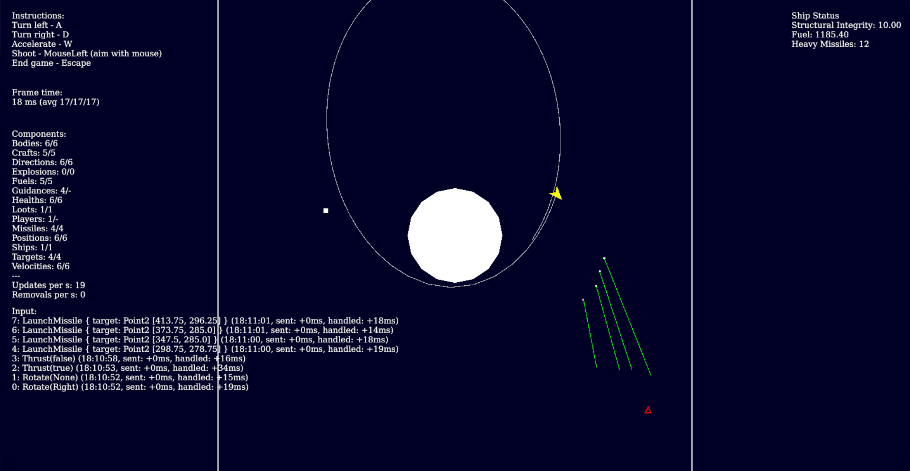

# Von Neumann Defense Force 

## About

Von Neumann Defense Force is a game about spaceships. It is the continuation of [an earlier project](https://github.com/hannobraun/vndf-2016) of the same name.



The project is in development, and might well stay there forever. As the next section details, a lot of things are in a rough state. Pull requests are still very welcome, however.

## Status

This is a hobby project with no clear goal in mind. As such, I only work on whatever interests me, while leaving other things in half-done or broken states.

From a gameplay perspective, there's not a lot there. We have working multiplayer, and there are game mechanics, but they don't form a coherent whole.

From a technical perspective, the code is in a constant state of transition. Most of the gameplay code is basically an experiment in how to structure code such as this, so far without any satisfactory results. Little of that has been documented.

## Instructions

### Quickly testing the game

```
cargo run
```

This starts a test client with a built-in server. This is useful for quickly testing stuff, but it doesn't provide any multiplayer features.

### Run the game with a local server

Start the local server:
```
cd vndf-server
cargo run
```

In another terminal, start a client to connect to that server:
```
cd vndf-launcher
cargo run -- --local
```

Using this technique, you can connect with any number of clients, until you run into scalability issues. As of this writing, games have been run with up to three clients.

### Play the game on the official test server

```
cd vndf-launcher
cargo run
```

Please note that this will most likely result in a crash and a cryptic error message. If not, it might result in weird and unpredictable gameplay behavior.

The reason for that is, that only clients and servers running with the same version are compatible. No version check is implemented, so even if the protocol happens to be compatible, client and server might be running with different game code.

The official server is updated in a manual and haphazard manner, so you never quite know which version it is currently running.

## License

All code in this repository is available under the [Zero-Clause BSD License](https://opensource.org/licenses/0BSD) (0BSD). This basically means you can do anything with it, without any restrictions.

Here's the full license text:

Permission to use, copy, modify, and/or distribute this software for any purpose with or without fee is hereby granted.

THE SOFTWARE IS PROVIDED "AS IS" AND THE AUTHOR DISCLAIMS ALL WARRANTIES WITH REGARD TO THIS SOFTWARE INCLUDING ALL IMPLIED WARRANTIES OF MERCHANTABILITY AND FITNESS. IN NO EVENT SHALL THE AUTHOR BE LIABLE FOR ANY SPECIAL, DIRECT, INDIRECT, OR CONSEQUENTIAL DAMAGES OR ANY DAMAGES WHATSOEVER RESULTING FROM LOSS OF USE, DATA OR PROFITS, WHETHER IN AN ACTION OF CONTRACT, NEGLIGENCE OR OTHER TORTIOUS ACTION, ARISING OUT OF OR IN CONNECTION WITH THE USE OR PERFORMANCE OF THIS SOFTWARE.
